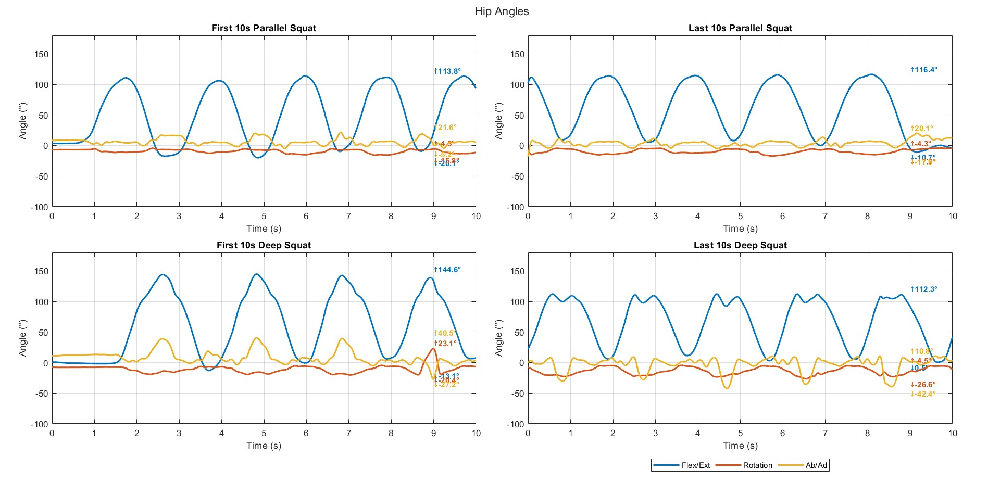
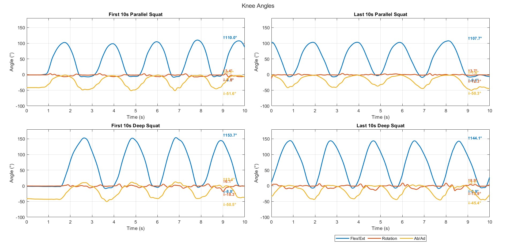
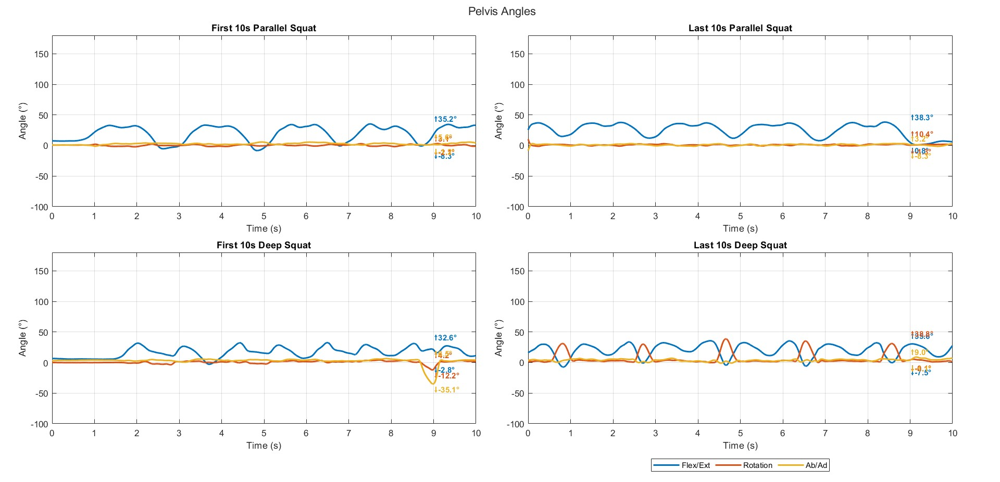
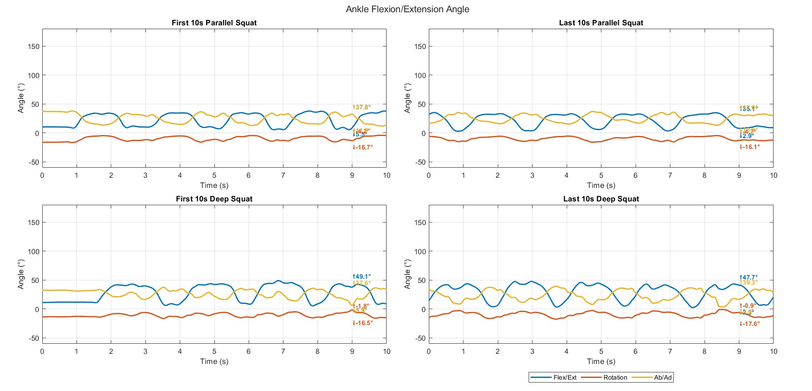

# 🏋️‍♂️ Squat Angle Analysis

This MATLAB project visualizes joint angles during **deep squats** vs. **parallel squats** using motion capture data. It provides a simple way to compare hip, knee, and pelvis angles through plotted graphs and stick figure animations.
In this task, the subject performed two types of squats: deep squats (where the hip goes below parallel) and parallel squats (where the hip reaches parallel to the ground). For both conditions, the subject completed the maximum number of repetitions possible. The analyzed data compares the first and last 10 seconds of each squat type.

## 📂 Project Structure

The repository includes:

- MATLAB scripts:
  - `squat_analysis.m` – Main script to run the analysis
  - `StickFigure1.m`, `TwoAngleNew.m`, `unitvec.m`,`cylinder2p` – Supporting visualization and processing functions
- Data files:
  - `req_squats.csv`, `deep_squat.csv` – Squat motion data
- Figures:
  - `ankle_angle.jpg`, `hip_angle.jpg`, `knee_angle.jpg`, `pelvis_angle.jpg`

## ▶️ How to Run

1. **Download all `.m` files** from this repository.
2. Open MATLAB and navigate to the folder containing the files.
3. Run the script `squat_analysis.m`.

This will generate plots comparing joint angles and display stick figure animations of the squats.

## 📊 Sample Outputs

### Animation of the movement

### Hip Angle Comparison

### Knee Angle Comparison

### Pelvis Angle Comparison

### Overall Angle Analysis

## 🧠 Purpose

This project is designed to help visualize and understand the biomechanics of squatting. It can be useful for:

- Sports scientists
- Physiotherapists
- Fitness professionals
- Biomechanics researchers

## 📜 License

This project is open-source and available under the MIT License.

---
